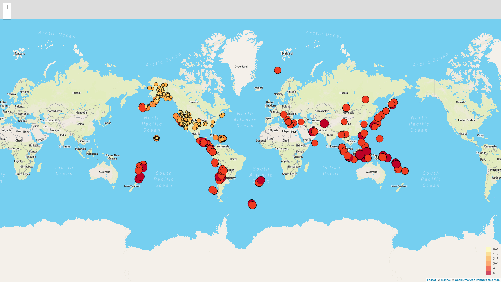
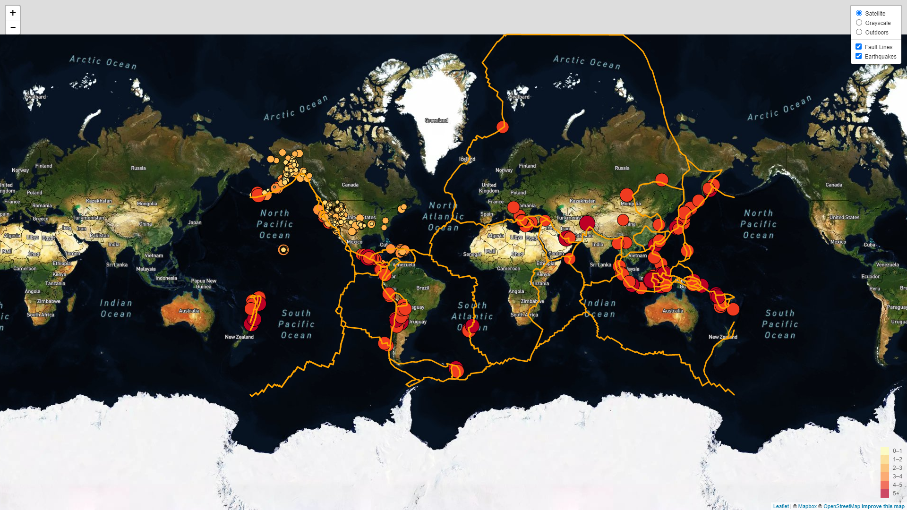

# Visualizing Earthquake Data with Leaflet

Welcome to the United States Geological Survey, or USGS for short! The USGS is responsible for providing scientific data about natural hazards, the health of our ecosystems and environment; and the impacts of climate and land-use change. Their scientists develop new methods and tools to supply timely, relevant, and useful information about the Earth and its processes.

This project visualizes USGS's earthquake data. They collect a massive amount of data from all over the world each day, but they lack a meaningful way of displaying it. This project visualizes their data that will allow them to better educate the public and other government organizations (and hopefully secure more funding..) on issues facing our planet.

## Leaflet-Step-1

## Leaflet-Step-2

## Programming Language / Applications - Used
  * HTML
  * JavaScript
    - D3.js
    - Leaflet
  * CSS
  * GeoJSON

---

## Contributors

- Usha Saravanakumar (ushaakumaar@gmail.com)
